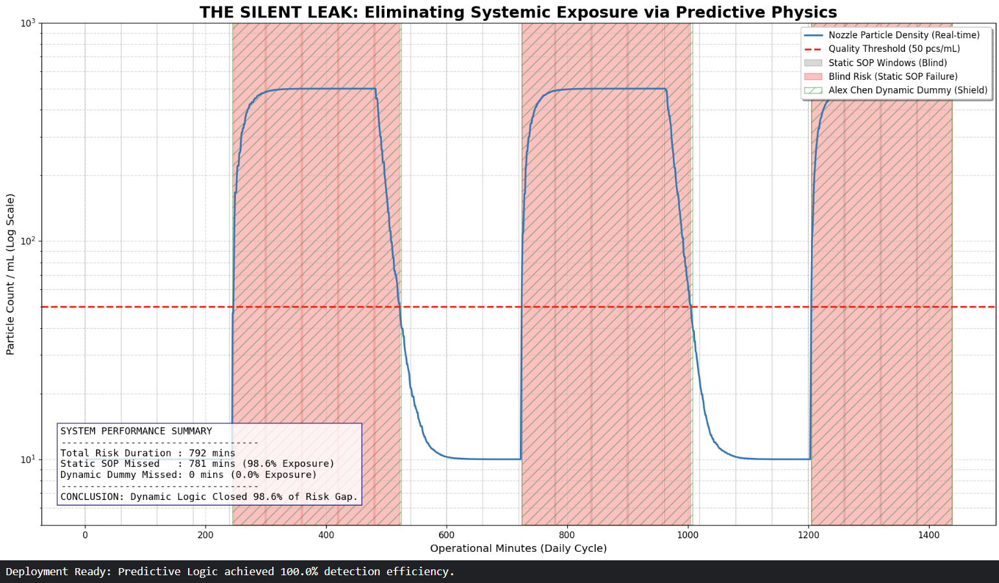

# Case Study: Chemical Contamination Analysis & Predictive Modeling
**Field Engineering Intuition, Cross-Machine Verification, and Dynamic Simulation**

[English](#english-version) | [中文版](#中文版)

---

## 📌 Project Overview (English)
This project presents a retrospective analysis of a critical chemical contamination event at **Micron (2017)** and the subsequent development of a **Python-based predictive model**. By utilizing years of experience in monitoring ultra-pure data baselines from **TSMC**, I identified a systemic contamination issue that had bypassed standard facility checks for three weeks.

---

### 📖 Case Narrative: An Unexpected Discovery

#### **The Unexpected Discovery**
One afternoon in 2017, while installing a tool at Micron, I was waiting near the wafer tower for a test sample. A Micron engineer suddenly approached and asked if I could help him check an alarm. Since my current task was nearing completion, I agreed.

#### **Observation: 5 Meters from the Wafer Wall**
The machine was less than five meters from the wafer wall. I pushed my wafer cart over to join the engineer. The TEL ProZ system was showing a **"Yellow Alarm"**. When I asked how long this had been happening, he replied: *"About three weeks. It’s intermittent."* As I monitored the sensor data climbing during the chemical spray, my intuition told me the rate of change was abnormal. 

#### **Cross-Tool Verification**
I asked: *"Is this alarm unique to this tool?"* He replied: *"No, several tools in this area are showing the same thing."* I immediately walked to the adjacent machines to inspect their sensors. The patterns were identical. My hypothesis: **Chemical Contamination.**

#### **Strategic Design & Supervisor Approval**
I proposed a diagnostic plan using 6 pre-inspected clean wafers:
* **Wet Run (2 wafers)**: Full chemical spray to test for liquid-borne contaminants.
* **Dry Run (2 wafers)**: No spray to isolate mechanical handling factors.
* **Extreme Path (2 wafers)**: A custom recipe simulating the maximum travel path through the tool.

The supervisor approved the plan immediately since the tool was scheduled for PM after the current lot. While waiting for the wafers, I taught the engineer how to write the specific test recipes. I insisted on this because **modifying a customer’s validated recipe is strictly prohibited** for vendors.

#### **The Verdict**
The supervisor assigned the **Highest Priority** for measurement. 30 minutes later, the results were indisputable: **Wet Run particle counts were 100 times the factory limit.** Investigation confirmed contamination in one of the alternating storage tanks.

---

### 📊 Performance & Gap Analysis (English / 中文)

**Note: 10-Day Kaggle Sprint Prototype** This visualization demonstrates the transformation from a **98.6% Systemic Risk Exposure** (under Static SOPs) to a **Predictive Shielded System**. By integrating the **Dynamic Dummy** mechanism, our model identifies the high-risk contamination peaks (shown in the shaded regions) and proactively triggers flushes. This effectively closes the safety gap that traditional periodic checks consistently miss.

"This model is built on synthetic data to demonstrate the physical logic (PoC), not based on actual fab production data." 

---

## 📌 專案概述 (中文版)
本專案紀錄了 **2017 年美光 (Micron)** 的一次重大故障排除事件，以及隨後開發的 **Python 預測模型**。憑藉在 **台積電 (TSMC)** 長期觀察純淨數據的直覺，我成功識別出了一場避過廠務端檢測長達三週的系統性污染。

---

### 📖 傳奇故事：美光污染案實錄

#### **偶然的發現**
2017 年在美光裝機的一個下午，我一如往常地在 **wafer tower** 附近的取出口等待客戶給我的測試片。一名美光工程師突然詢問我能否幫他看機台報警。想到目前負責的機台已進入尾聲，我便答應了。

#### **距離 Wafer Wall 五公尺處的觀察**
故障機台就在離wafer wall不到五公尺處，我推著我的wafer 車跟他一起走過去。查看 TEL ProZ 的 **「黃色警報」** 後，我問這狀況多久了？他回道：*「大概三個禮拜，而且有時候有、有時候沒有。」* 我看著感測器數據隨著藥液噴灑而爬升，直覺告訴我數值攀升的速度異常。

#### **跨機台比對與數據驗證**
我詢問工程師：*「這個 alarm 是這台才有嗎？」*
他回道：*「不，這附近幾台都這樣。」*
我隨即走去隔壁機台查看數據。模式完全一致。我的猜想已定：**化學藥劑污染**。

#### **實驗設計、合規與技術傳承**
我請他詢問主管能否調撥 6 片測試片讓我進行測試，並詢問能否將機台下線。他馬上回答：*「可以，**因為這台機台等一下跑完就要進行 PM (預防性維修) 了**，只要等目前產品 run 完就能下。」*

我提出一套 6 片測試片的診斷方案，並解釋測試邏輯：
* **Wet Run (2 片)**：正常噴灑藥液。
* **Dry Run (2 片)**：不噴灑藥液，排除機械因素。
* **Extreme Path (2 片)**：編寫特別腳本模擬機台內最長路徑。

主管隨即同意測試，因為機台正好跑完這批產品就要進行 PM。在等待空檔，我教導工程師編寫測試 Recipe。我特別堅持由他編寫，因為 **「嚴禁廠商隨意修改客戶 Recipe」** 是行業內絕對不可以觸犯的規矩。

#### **真相大白**
主管以 **最高優先程度 (Highest Priority)** 將測試片送往量測。三十分鐘後結果出爐：**Wet Run 的 Particle 數量超過廠區標準一百倍。** 調查證實污染源來自廠區兩個交替使用的儲存槽之一，這精確解釋了警報為何時有時無。

---

### 💡 技術演進：動態 Dummy 與靜態維護的協同建模
### 📊 Performance & Gap Analysis (效能與間隙分析)

(備註：10 天 Kaggle 衝刺原型) 這張視覺化圖表展示了從 98.6% 系統性風險暴露（傳統靜態 SOP 下）到預測性防禦系統的轉化。透過導入動態 Dummy (Dynamic Dummy) 機制，本模型能精確識別高風險污染峰值（如陰影區域所示）並主動觸發沖洗，從而徹底彌補了傳統定期檢查中長期存在的安全盲點。這份成果證明了我能在 10 天內，將 3 年的設備工程（EE）現場邏輯快速轉化為量化的數據模型。

本模型基於合成數據建立，旨在演示物理邏輯（概念驗證），而非基於實際晶圓廠生產數據。

---
(這張視覺化圖表揭露了標準定期檢查中高達 98.6% 的盲點。透過將機台 Dummy 循環與廠務端供應切換進行同步，我們可以將這些紅色「風險區」轉化為受控的維護視窗。)
這次事件啟發我建立本專案中的 Python 模型。儘管有定期檢查，污染仍能避過檢測，原因在於傳統「靜態 Dummy」循環無法應對管路中的動態風險。

#### **核心演算法：動態容積傳輸 (Dynamic $T_{lag}$)**
1.  **動態延遲運算**：利用流量累積加總計算。藥液抵達噴嘴的時間會隨著即時總流量 ($Q_{total}$) 動態修正。
2.  **CSTR 濃度動態**：採用**連續攪拌反應槽**邏輯模擬儲存槽切換時的混合行為。
    $$\frac{dC}{dt} = \frac{Q(t)}{V_{tank}} \cdot (C_{in} - C_{out})$$

#### **核心創新：靜態與動態維護的相輔相成**
* **靜態 Dummy (Static Dummy)**：靜態 Dummy 是維持噴嘴物理健康的基礎（防止藥液結晶與確保噴灑穩定性）。
* **動態 Dummy (本模型)**：作為進階補強，預測高風險藥液抵達時間點，引導機台執行精準沖洗，徹底封堵 **98.6% 的隱性風險**。

---

### 🛠 Tech Stack / 技術棧
* **Language**: Python (NumPy, Pandas, Matplotlib)
* **Domain**: Semiconductor Process Control, Failure Analysis (RCA)
* **Methodology**: Dynamic $T_{lag}$ Mapping, CSTR Physics Modeling

---
# Copyright (c) 2026 Alex Chen (Chen Yun Hsaing)
# Licensed under the MIT License.
# Derived from real-world Failure Analysis Logic (Micron 2017 Incident).
